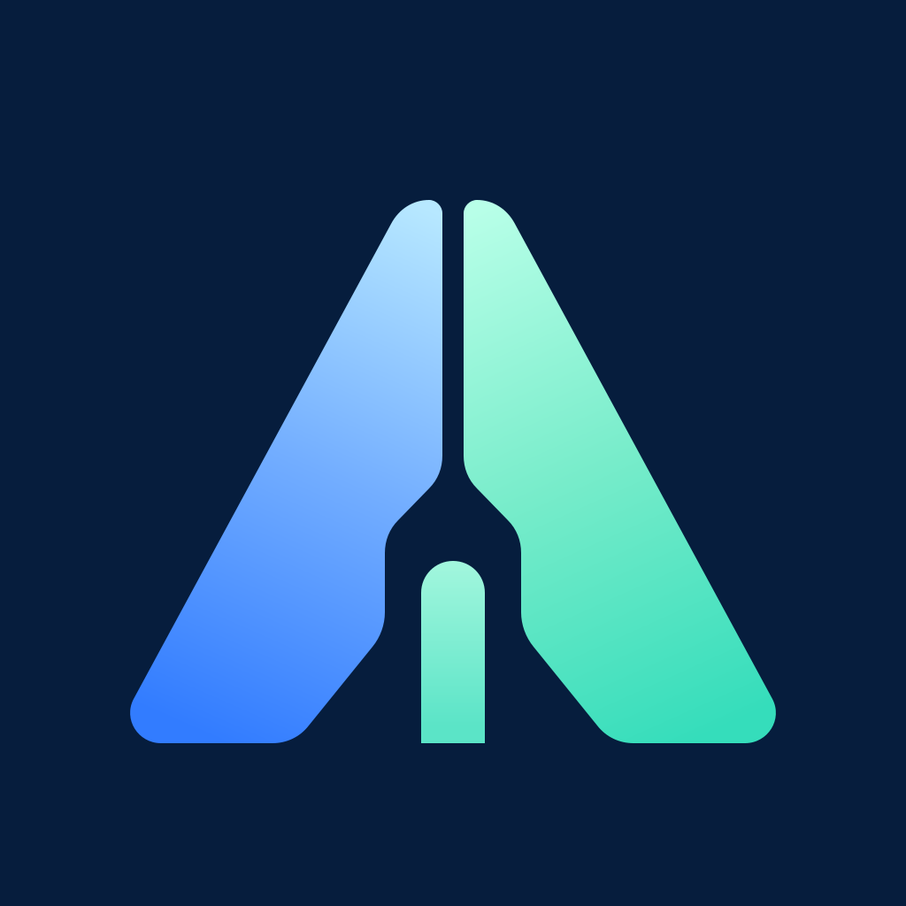

# 品牌图标

正式品牌母版为 [`docs/internal/assets/aster-team-product-icon-v1.svg`](internal/assets/aster-team-product-icon-v1.svg)。它是由路径和渐变组成的原生 SVG，不包含嵌入式位图。

## 使用规则

- 母版画布固定为正方形 `1024 × 1024`，背景色为 `#061D3D`。
- 母版不预设圆角、透明角、外框或阴影。操作系统、浏览器和发布平台按各自规范裁切。
- 页面内可以通过 CSS 设置圆角和尺寸，但不得修改 SVG 本身的画布、留白和图形比例。
- 需要 PNG、ICO 或其他尺寸时，从 SVG 母版导出，不再单独绘制另一个版本。
- 品牌名称使用 `Aster Team`；图标中不额外加入 `A`、`AT` 或其他文字。

## 前端位置

四个前端的浏览器图标均为母版副本：

- `customer/admin/public/favicon.svg`
- `customer/member/public/favicon.svg`
- `operations/console/public/favicon.svg`
- `website/public/favicon.svg`

管理端、成员端和运营端的页面品牌标记使用 `@aster/ui` 提供的 `ABrandMark` 内联矢量组件，避免运行时资源路径影响测试和离线部署；官网页头与页脚直接使用 `/favicon.svg`。

修改品牌图标时，先更新母版，再同步四份浏览器资源并执行 `npm run verify:docs`。文档校验会拒绝内容不一致的副本。
